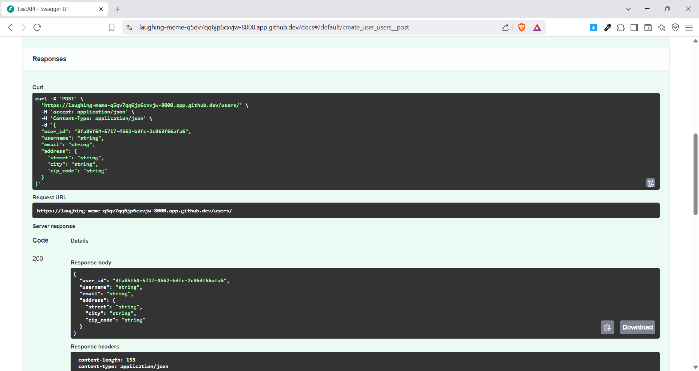

# SOA - HOMEWORK 05

```sh
Huynh Thanh Liem - 52100813
```

## Objectives Achieved
Homework 9 enables students to master the use of FastAPI and Pydantic for building APIs, managing UUIDs and datetimes, designing nested data structures, implementing data validation, and enhancing effective API programming skills.

## Installation

To set up the FastAPI application for Homework 9, follow these steps:

1. **Install Python**: Ensure you have Python 3.7 or higher installed on your system. You can download it from [python.org](https://www.python.org/downloads/).

2. **Create a Virtual Environment** (optional but recommended):
   ```bash
   python -m venv venv
   ```
   Activate the virtual environment:
   - On Windows:
     ```bash
     venv\Scripts\activate
     ```
   - On macOS/Linux:
     ```bash
     source venv/bin/activate
     ```

3. **Install FastAPI and Uvicorn**: Run the following command to install the necessary dependencies:
   ```bash
   pip install fastapi uvicorn
   ```

4. **Run the Application**: Start the FastAPI server using Uvicorn with the following command:
   ```bash
   uvicorn exercise01.main:app --reload
   ```

*Or just run as python file*

5. **Access the API**: Open your web browser and navigate to `http://127.0.0.1:8000/docs` to view the automatically generated API documentation.

## Result

### Exercise 01: UUID and Datetime Fields

> *Create a FastAPI endpoint that receives and returns data containing both UUID and datetime fields.*


### Exercise 02: Nested Models

> *Develop a FastAPI endpoint that handles requests with nested models, including user information and address details.*



### Exercise 03: List Fields

> *Implement a FastAPI endpoint that processes requests containing list fields, allowing for the submission of order information with multiple products.*


### Exercise 04: Advanced Nested Structures

> *Create a FastAPI endpoint with a deeply nested structure, including datetime fields and a list of comments for a blog post.*


### Exercise 05: Validation and Nested UUID/Datetime

> *Enhance the FastAPI endpoint to validate UUID and datetime fields in nested structures, ensuring that deadlines for tasks are set in the future.*


